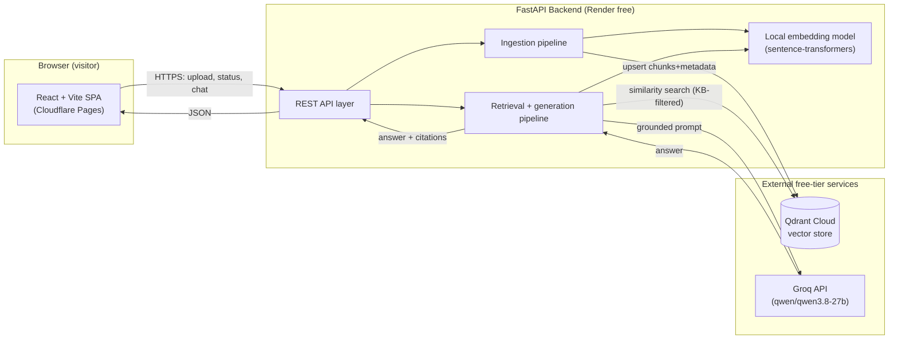
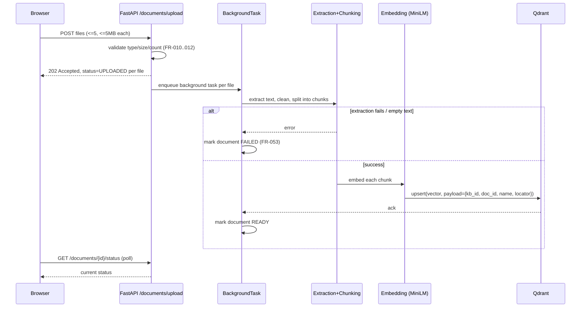
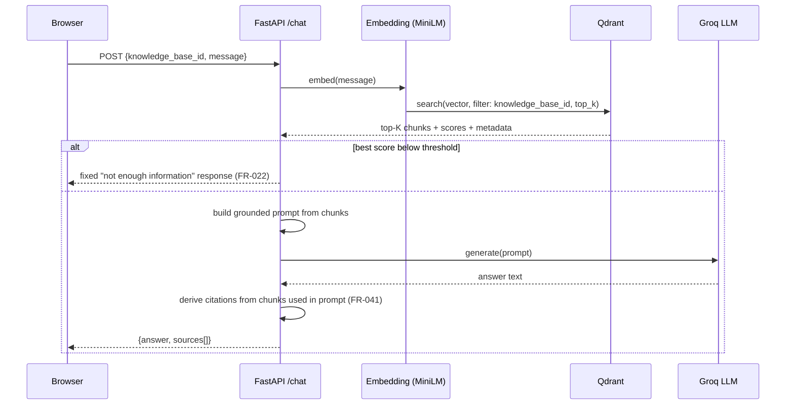
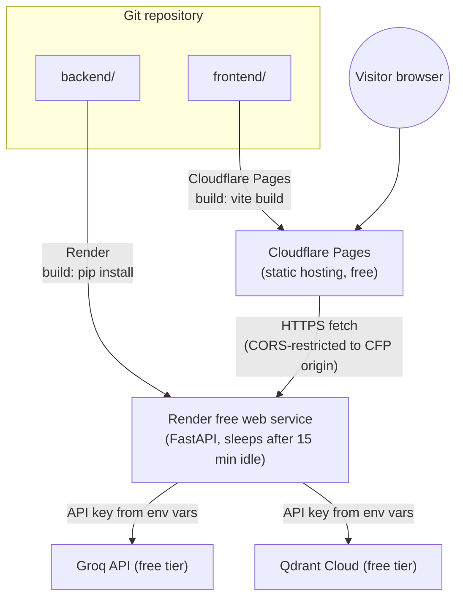

# System Architecture

Companion to `docs/ARCHITECTURE_DECISIONS.md` (why) and `docs/REQUIREMENTS.md`
(what). This document describes the resulting system (how it fits together).

## 1. High-Level Architecture



No component other than the FastAPI backend ever holds an LLM or vector-DB
API key (ADR-15). The browser only ever talks to the backend.

## 2. Frontend Architecture

- **Framework:** React + Vite SPA, vanilla CSS (ADR-01, ADR-02).
- **View structure:** single page with three coordinated regions —
  Knowledge-Base Selector, Chat panel, Upload/Documents panel (see
  `docs/UI_UX.md` for full state definitions).
- **State management:** local component state + a small shared context for
  `activeKnowledgeBaseId` and `sessionToken`; no external state library
  needed at this scale.
- **Session identity:** an anonymous session token is issued by the backend
  on first contact (`GET /health` or first upload) and stored in
  `localStorage`; sent as a header (`X-Session-Token`) on every subsequent
  request that touches a user-owned knowledge base.
- **Networking:** a single typed API client wrapping `fetch`, matching
  `docs/API.md` exactly.
- **Build output:** static `dist/` deployed to Cloudflare Pages (ADR-09); no
  server-side rendering.

## 3. Backend Architecture

FastAPI app organized by responsibility, not by HTTP verb:

```
backend/
  main.py                # FastAPI app, router registration, CORS config
  api/
    health.py             # GET /health
    knowledge_bases.py     # GET /knowledge-bases, GET .../documents
    documents.py           # POST /documents/upload, GET/DELETE /documents/{id}
    chat.py                # POST /chat
  ingestion/
    extract.py             # text extraction per file type
    chunk.py               # LangChain text splitters (ADR-05)
    embed.py                # sentence-transformers wrapper (ADR-06)
    pipeline.py             # orchestrates extract→chunk→embed→upsert, BackgroundTasks (ADR-13)
  retrieval/
    vector_store.py         # Qdrant client adapter (ADR-07, ADR-14)
    retriever.py             # similarity search + KB filter + top-K
    generation.py             # prompt construction + Groq call (ADR-08)
  models/
    schemas.py               # Pydantic request/response models (source of docs/API.md)
  config.py                  # env var loading (ADR-15)
```

Request lifecycle for a chat request: `api/chat.py` → `retrieval/retriever.py`
(embed query, filtered search) → `retrieval/generation.py` (build prompt,
call Groq) → response assembled with citations back through `api/chat.py`.

## 4. RAG Architecture

See `docs/RAG_PIPELINE.md` for the full stage-by-stage specification. In
brief: documents are extracted, cleaned, chunked (LangChain
`RecursiveCharacterTextSplitter`), embedded locally (MiniLM), and upserted
into Qdrant with metadata payload (`knowledge_base_id`, `document_id`,
`document_name`, `page`/`chunk_index`). A chat query is embedded the same
way, searched against Qdrant filtered to the active `knowledge_base_id`,
top-K chunks are assembled into a grounded prompt, and Groq generates an
answer that the backend pairs with citations derived from the chunks
actually included in the prompt (FR-041).

## 5. Document Ingestion Architecture



## 6. Query Architecture



## 7. Knowledge-Base Architecture

- One Qdrant collection, shared across all knowledge bases (ADR-14).
- Every point (chunk vector) carries a mandatory `knowledge_base_id` payload
  field; every query and every write path requires this parameter with no
  default — enforced in `retrieval/vector_store.py` as the single choke
  point through which all Qdrant access happens.
- Demo KB: fixed ID (e.g. `kb_demo`), globally readable, never writable via
  the public API — it is seeded only by an offline/deploy-time script
  (`backend/scripts/seed_demo_kb.py`, see `docs/DOCUMENT_PROCESSING.md`).
- User KB: ID derived from the session token (e.g. `kb_user_<session_uuid>`),
  writable/deletable only by requests carrying the matching session token.

## 8. Storage Architecture

| Data | Where it lives | Persistence | Notes |
|---|---|---|---|
| Chunk vectors + metadata | Qdrant Cloud | Persistent (subject to ADR-07 suspension risk) | Single source of truth |
| Raw uploaded file | Backend temp directory | Transient — deleted after ingestion (ADR-11) | Never served back to client |
| In-flight processing status | Backend process memory | Transient — lost on backend restart | Acceptable per ADR-12 |
| Session token / active KB | Browser `localStorage` | Persistent client-side only | No server-side session store |
| Chat message history | Browser memory/`localStorage` | Persistent client-side only | Never sent to a database (FR-023) |

## 9. Deployment Architecture



Deployment sequence, environment variables, and cost model are fully
specified in `docs/DEPLOYMENT.md` and `docs/ENVIRONMENT.md`.

## 10. Security Boundaries

- **Trust boundary 1 — Browser ↔ Backend:** the only boundary the public
  crosses. All input validated server-side (NFR-006) regardless of any
  client-side validation. CORS restricts allowed origins to the deployed
  Cloudflare Pages domain (and `localhost` in dev).
- **Trust boundary 2 — Backend ↔ Groq/Qdrant:** secrets live only here
  (ADR-15); this boundary is never reachable from the browser.
- **Trust boundary 3 — Session isolation:** a session token authorizes
  access only to its own `kb_user_<id>` knowledge base; the demo KB is
  read-only to everyone and write-protected from the public API entirely.
- Full threat-by-threat treatment: `docs/SECURITY.md`.

## Cross-Reference

- Data shapes: `docs/DATA_MODEL.md`
- Endpoint contracts: `docs/API.md`
- UI states per component: `docs/UI_UX.md`
